# Git

## Ở trên repo hiện tại, git config local username và email

```
- git config --global user.name "lupmit1"
- git config --global user.email "phucle.24hdev@gmail.com"
```

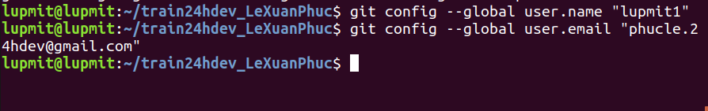

## Checkout master 1 branch là develop
```
- git checkout main
- git branch develop
- git checkout develop
```

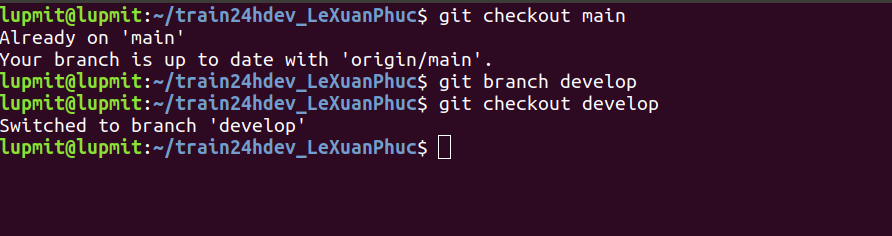

## Trên branch develop tạo 1 file demo.log, 1 file index.html với nội dung in ra dòng chữ “Hello world”. Làm thế nào để git không tracking tất cả file .log (dùng .gitignore). Sau đó tạo 1 commit add file index.html

 Tạo file gitignore
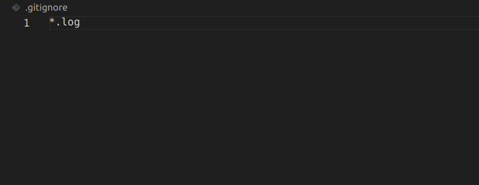
```
- git add .
- git commit -m "add index.html"
- git push origin develop
```
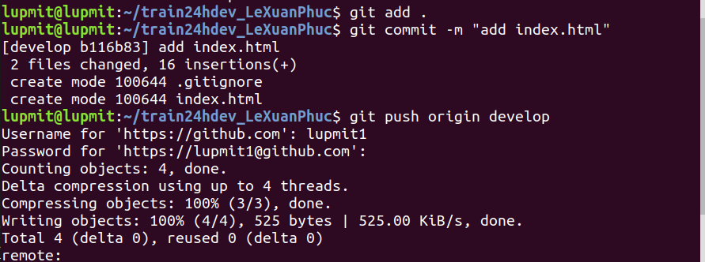

## Sửa đổi nội dung trên file index.html sau đó làm thế nào để revert lại file index.html trước khi sửa đổi không dùng undo mà dùng lệnh git.
```
- git log
```
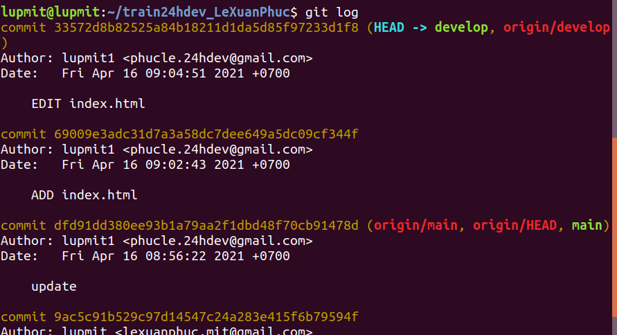

Sau khi sửa nội dung ta sử dụng git revert để revert file index
```
- git revert
```
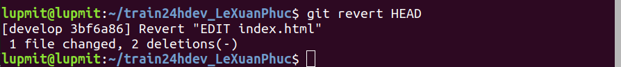


## Tạo 1 file demo.html với nội dung in ra dòng chưa “This is file demo”, tạo một commit mới add file demo.html và push code lên origin.
```
- git add . 
- git commit -m "add demo"
- git push origin develop
```

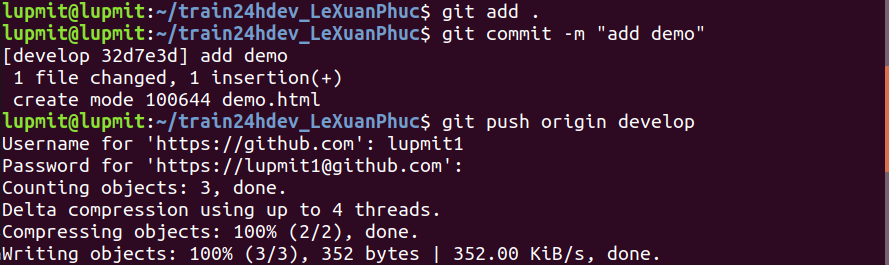

## Sửa đổi lại nội dung file demo.html với nội dung “This is a demo file” như không tạo thêm một commit mới nào cả chỉ là thay thế commit cũ và push lại code lên origin

```
- git add .
- git commit --amend
- git push -f origin develop
```
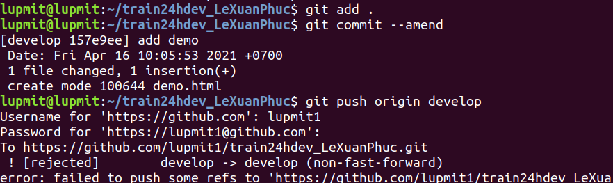


## Tạo 1 branch mới là feature_a, rồi thêm môt file feature.html với nội dung bất kì rồi tạo một commit. Sử dụng git cherry-pick để lấy commit mới của feature_a vào branch develop. 

```
- git checkout main
- git branch feature_a
- git checkout feature_a
```
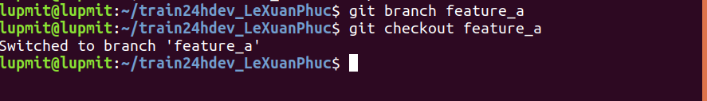

```
- git checkout develop
- git cherry-pick feature_a~2
```

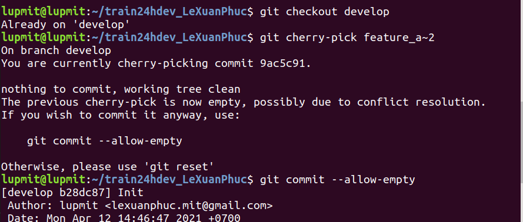


## Sửa đổi file feature.html sau khi cherry-pick ở trên branch develop rồi tạo 1 commit. Sử dụng git rebase branch feature_a với branch develop (Nếu có conflict thì resolve và rebase --continue)
```
- git add .
- git commit -m "edit feature"
- git push origin develop
```
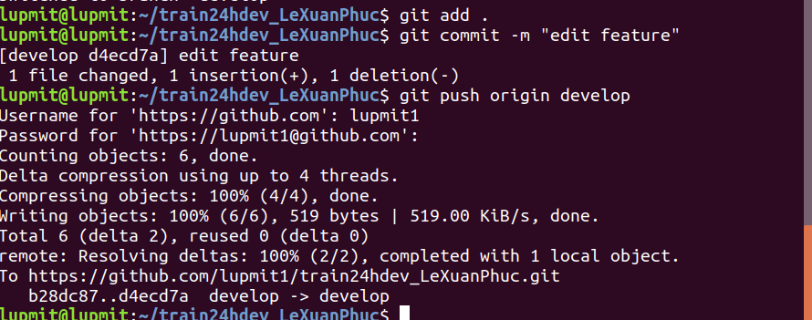

```
git add feature.html
git rebase feature_a
git reabase --continue
```
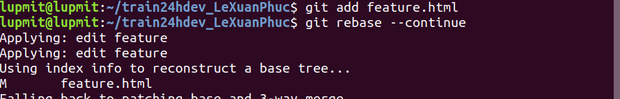