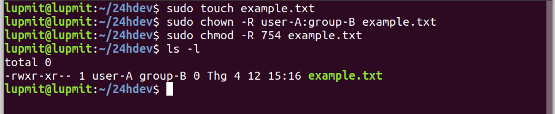
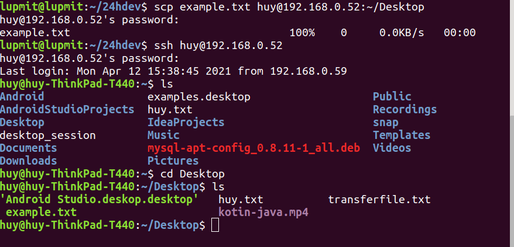
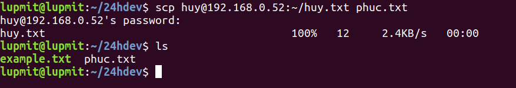
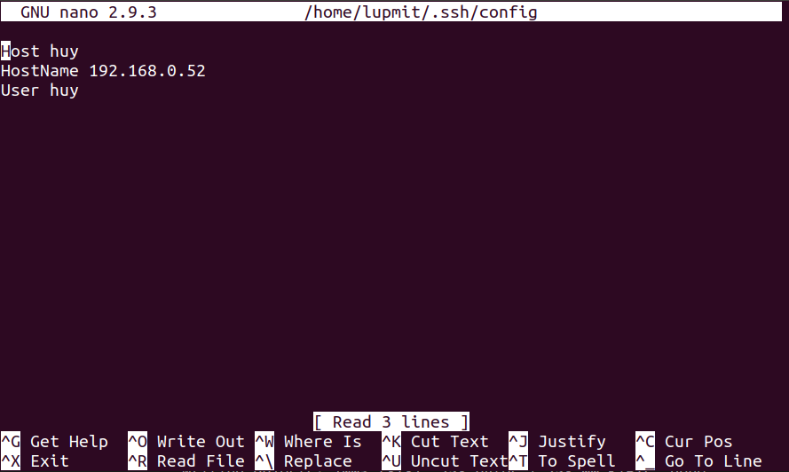
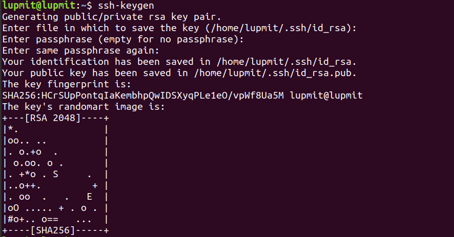
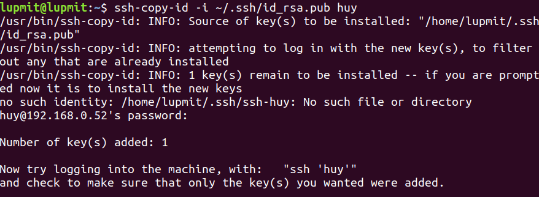

# User, Group, File, Ssh
## Tạo ở máy em 3 user user-A, user-B, user-C và 2 group group-A, group-B
```
- sudo useradd -m -c "user-A" user-A
- sudo useradd -m -c "user-B" user-B
- sudo useradd -m -c "user-C" user-C
```

```
- sudo groupadd group-A
- sudo groupadd group-B
```


## Cho user-A, user-B vào group-1, user-C vào group-2
```
- sudo usermod -g group-A user-A
- sudo usermod -g group-A user-B
- sudo usermod -g group-B user-C
```


## Tạo 1 file example.txt với phân quyền user-A có  read write exec, group-2 chỉ có read và exec. Các user còn lại có thể read.  Thử login vào user-C và sửa đổi file example.txt điều gì sẽ xảy ra?

Tạo file example.txt
```
- sudo touch example.txt
```
Phân quyền cho:
user-A: rwx
group-B: rx
các user còn lại: r

Các giá trị:
- 0: Không được phép thực hiện bất kỳ quyền nào
- 1: Thực thi
- 2: Viết
- 3: Viết và thực thi
- 4: Đọc
- 5: Đọc và thực thi
- 6: Đọc và viết
- 7: Đọc, viết và thực thi
```
- sudo chown -R user-A:group-B example.txt
- sudo chmod -R 754 example.txt
```


# Upload 1 file đến máy của một bạn thông qua ssh để ở thư mục /home/Desktop/

```
- scp example.txt huy@192.168.0.52:~/Desktop
```


# Download 1 file từ máy của một bạn thông qua ssh để ở thư mục ~/huy.txt

```
- scp huy@192.168.0.52:~/huy.txt phuc.txt
```


# Config để 2 máy có thể ssh với nhau mà không cần đòi hỏi mật khẩu.

```
sudo vi ~/.ssh/config
Host huy
HostName 192.168.0.52
User huy
```


```
- ssh-keygen
```

```
- ssh-copy-id -i ~/.ssh/id_rsa.pub huy
```

```
- ssh huy
```


# Sử dụng public key và private key để bảo mật connect gửi 2 máy. 
(giống bài 6)