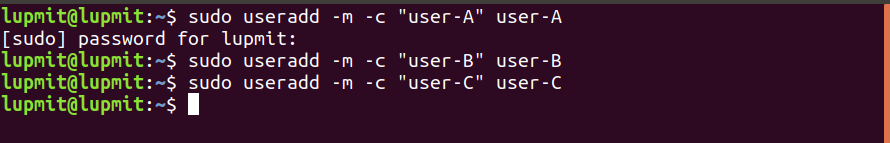

# User, Group, File, Ssh
## Tạo ở máy em 3 user user-A, user-B, user-C và 2 group group-A, group-B
- sudo useradd -m -c "user-A" user-A
- sudo useradd -m -c "user-B" user-B
- sudo useradd -m -c "user-C" user-C
