# Web Environment
## Cài đặt apache, ngnix

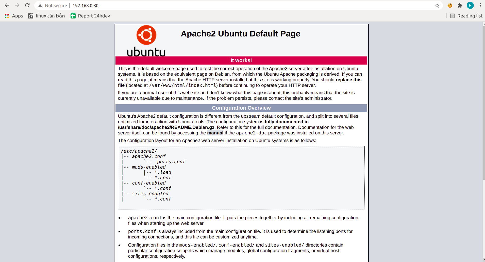
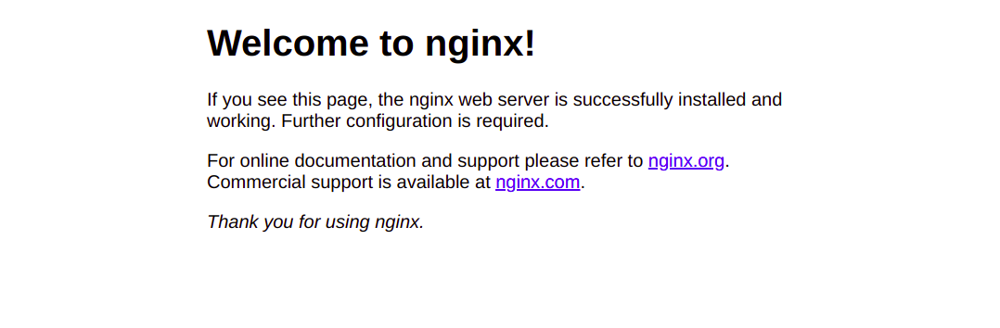

## Tạo trên máy mình 2 vitrual host để truy cập đến 2 resource web khác nhau bằng apache
Tạo 2 thư mục chứa 2 source web

```
- sudo mkdir -p /var/www/demo1.com/public_html
- sudo mkdir -p /var/www/demo2.com/public_html
```

Sao chép file config cho hai web mới
```
sudo cp /etc/apache2/sites-available/000-default.conf /etc/apache2/sites-available/demo1.com.conf
sudo cp /etc/apache2/sites-available/000-default.conf /etc/apache2/sites-available/demo2.com.conf
```

Chỉnh sửả config 2 file

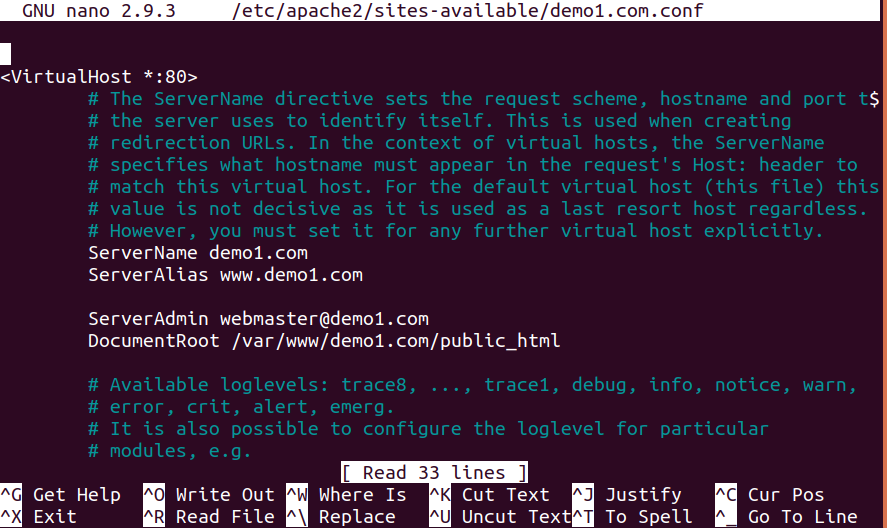
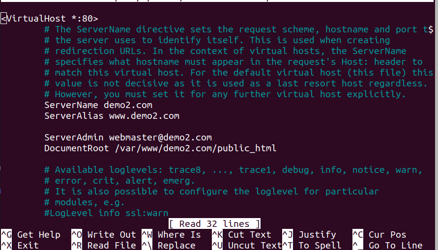s

Bật virtual host

```
- sudo a2ensite demo1.com.conf
- sudo a2ensite demo1.com.conf
```

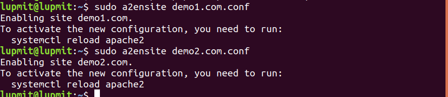

Thêm 2 file html để phân biệt

```
- sudo nano /var/www/demo1.com/public_html/index.html
- sudo nano /var/www/demo2.com/public_html/index.html
```
Thêm 2 tên miền vào file host tạo tên miền ảo

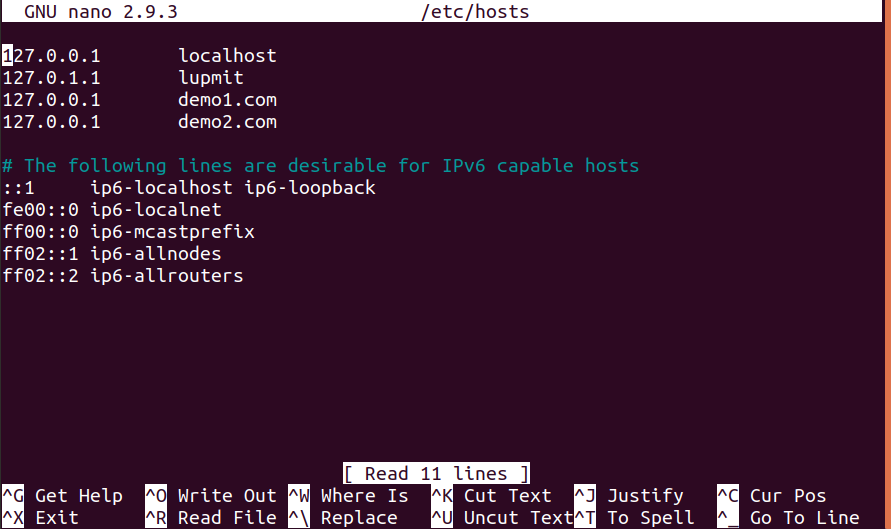

Khởi động lại apache2
```
- sudo service apache2 restart
```

Kết quả 
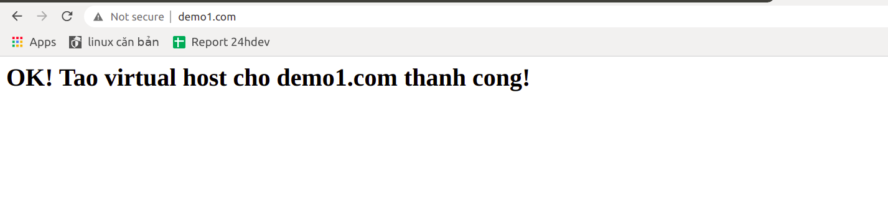
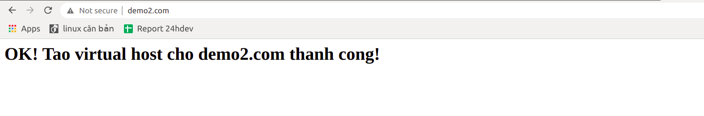

## Tương tự như vậy nhưng làm với với nginx

Tương tự apache tạo 2 thư mục chứa 2 source web

```
- sudo mkdir -p /var/www/demo1.com/public_html
- sudo mkdir -p /var/www/demo2.com/public_html
```

Tạo file config cho 2 website

```
- sudo nano /etc/nginx/sites-available/demo1.conf
- sudo nano /etc/nginx/sites-available/demo2.conf
```

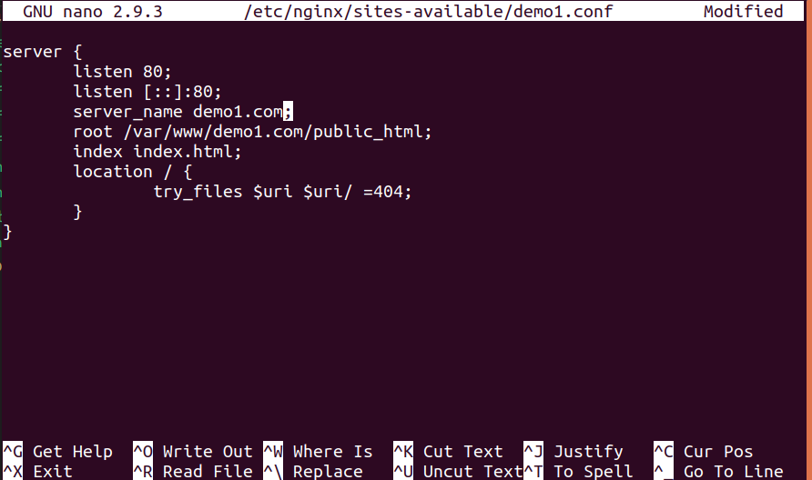
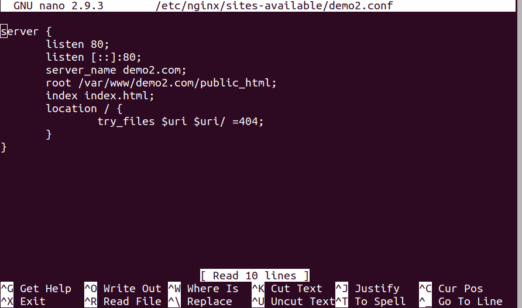

Tạo 2 file symbolic link tới thư mục /etc/nginx/sites-enabled/

```
sudo ln -s /etc/nginx/sites-available/demo1.conf /etc/nginx/sites-enabled/demo1.conf
sudo ln -s /etc/nginx/sites-available/demo2.conf /etc/nginx/sites-enabled/demo2.conf
```

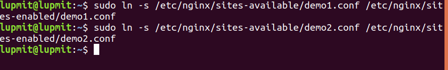

Reload nginx
```
- sudo systemctl reload nginx
```

Kết quả 


## Làm một vitrual host tại máy em. Khi truy cập vào vào http://demo.com sẽ show ra dòng chữ Hello world trên trang web.

### Sử dụng nginx

Tạo 2 thư mục chứa source web

```
- sudo mkdir -p /var/www/demo.com/public_html
```
Tạo file index.html
```
- sudo nano /var/www/demo.com/public_html/index.html
```

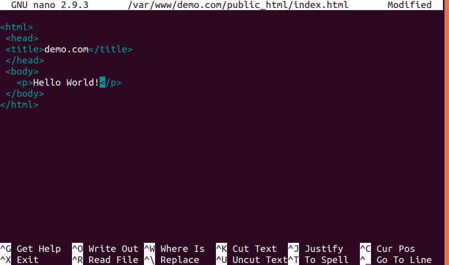

Tạo file config cho demo.com
```
- sudo nano /etc/nginx/sites-available/demo.conf 
```

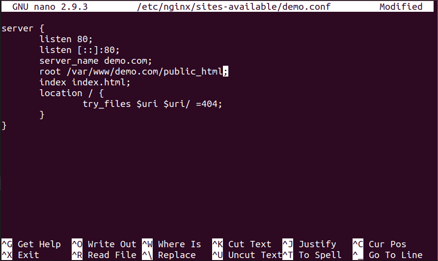

Tạo symbolic link

```
- sudo ln -s /etc/nginx/sites-available/demo.conf /etc/nginx/sites-enabled/demo.conf
```

Edit hosts tạo tên miền ảo demo.com

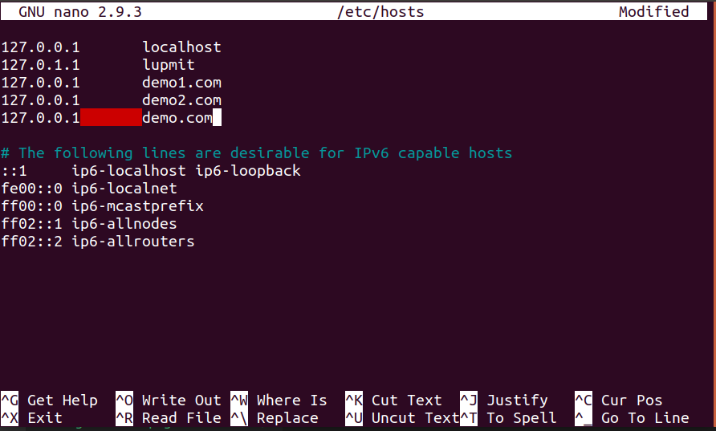

Reload nginx

```
- sudo systemctl reload nginx
```

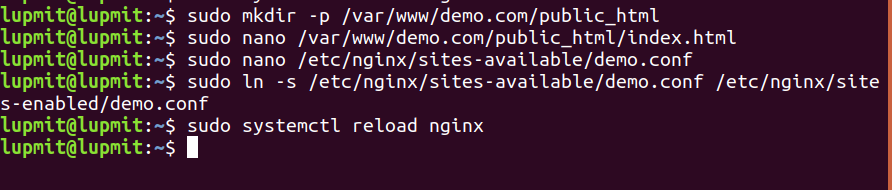

Kết quả

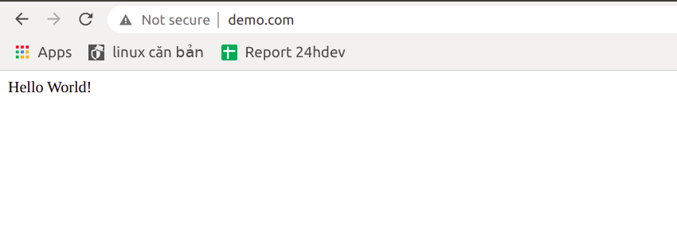

## Tạo 1 authenticate basic khi vào trang demo.com sẽ bắt nhập username và password. Gợi ý (.htaccess của apache hoặc auth_basic key của nginx)

### Sử dụng nginx

Sử dụng website demo.com ở bài trước để thực hiện

Cài đặt Apache Utils / HTTP Tools (Có sẵn khi cài nginx)

```
- sudo apt-get install apache2-utils
```

Tạo user, password để xác thực

```
- sudo htpasswd -c /etc/nginx/.htpasswd phuc24hdev
```

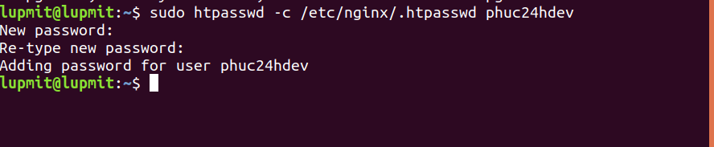
Cấu hình lại file config
```
- sudo nano /etc/nginx/sites-available/demo.conf 
```

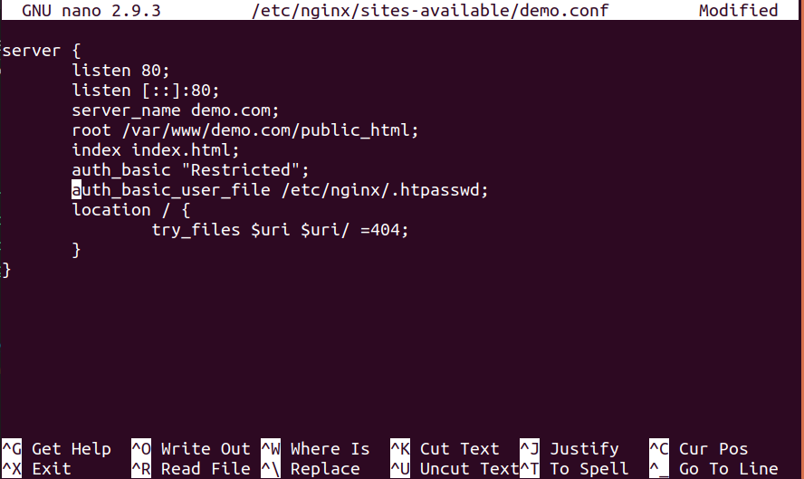

Reload nginx

```
- sudo systemctl reload nginx
```

Kết quả

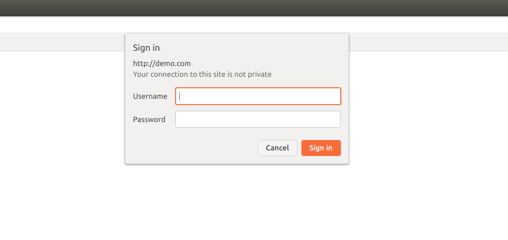

Sau khi đăng nhập thành công


