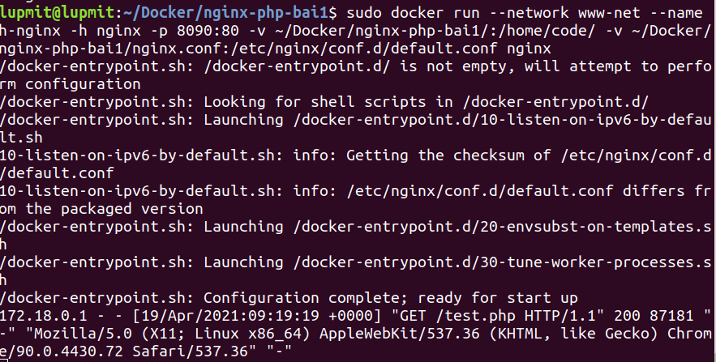

# Docker

## Build 1 service php (https://hub.docker.com/_/php), 1 serivce nginx (https://hub.docker.com/_/nginx) để cho thể show được trang php info lên web bằng docker

```
- docker pull php:7.3-fpm
```


```
- sudo docker network create --driver bridge www-net
```


```
- sudo docker run -d --name c-php -h php -v ~/Docker/nginx-php-bai1/:/home/code/ --network www-net php:7.3-fpm
```


```
- docker pull nginx
```


File config


```
-sudo docker run --network www-net --name h-nginx -h nginx -p 8090:80 -v ~/Docker/nginx-php-bai1/:/home/code/ -v ~/Docker/nginx-php-bai1/nginx.conf:/etc/nginx/conf.d/default.conf nginx

```


Kết qủa :


## Tổ chức các service trên vào trong 1 file docker-compose.yml

File config
```
server {
        listen 80;
	    server_name localhost;
        root /public_html;

        location / {
            index index.php index.html;
        }

        location ~* \.php$ {
            fastcgi_pass    php:9000;
            fastcgi_index   index.php;
            include         fastcgi_params;
            fastcgi_param SCRIPT_FILENAME $document_root$fastcgi_script_name;
            fastcgi_param PATH_INFO $fastcgi_path_info;
            }
}
```


File docker-compose.yml

```
version: '3'

services:
     web:
       image: nginx:alpine
       ports:
           - "8080:80"
       volumes:
           - ./public_html:/public_html
           - ./conf.d:/etc/nginx/conf.d
           - /etc/localtime:/etc/localtime
       networks:
           - nginxphp

     php:
       image: php:7.1.11-fpm-alpine
       volumes:
           - ./public_html:/public_html
       expose:
           - 9000
       networks:
           - nginxphp

networks:
     nginxphp:
```

```
- sudo docker-compose up -d
```


Ket qua:


## Thêm 1 service mysql (https://hub.docker.com/_/mysql), viết một chương trình php connect đến service mysql

Sửa file docker-compose.yml
```
version: '3'

services:

  mysql:
    image: mysql:latest
    ports:
      - "3306:3306"
    expose:
      - 3306
    environment: 
      - MYSQL_ROOT_PASSWORD=password
    networks:
      - nginxphp

  php:
    build: 
      context: .
      dockerfile: Dockerfile
    volumes:
      - ./public_html:/public_html
    ports: 
      - "9000:9000"
    networks:
      - nginxphp
    depends_on:
      - mysql

  web:
    image: nginx
    ports:
      - "8080:80"
    volumes:
      - ./public_html:/public_html
      - ./conf.d:/etc/nginx/conf.d
      - /etc/localtime:/etc/localtime
    networks:
      - nginxphp
    depends_on:
      - php

  phpmyadmin:
    image: phpmyadmin/phpmyadmin
    depends_on:
      - mysql
    ports:
      - "8082:80"
    environment:
      - PMA_HOST=mysql
      - PMA_USER=root
      - PMA_PASSWORD=password
      - PHP_UPLOAD_MAX_FILESIZE=100MB
    networks:
      - nginxphp
networks:
  nginxphp:
```
Dockerfile

```
FROM php:fpm
RUN docker-php-ext-install mysqli && docker-php-ext-enable mysqli
```
```
- sudo docker-compose up -d
```
File index.php
```
<!DOCTYPE html>
<html lang="en">

<head>
    <meta charset="UTF-8">
    <meta http-equiv="X-UA-Compatible" content="IE=edge">
    <meta name="viewport" content="width=device-width, initial-scale=1.0">
    <title>Document</title>
</head>

<body>
    <h1>Hello Docker</h1>
</body>
<?php
$host = "mysql";
$user = "root";
$password = "password";
$db = "test_db";

$conn = new mysqli($host,$user,$password, $db);

if ($conn->connect_error) {
    die("Connection failed: " . $conn->connect_error);
}

$sql = "SELECT id, email FROM email";
$result = $conn->query($sql);

if ($result->num_rows > 0) {

    while($row = $result->fetch_assoc()) {
        echo "id: " . $row["id"]. " - email: " . $row["email"].  "<br>";
    }
} 
else {
    echo "0 results";
}
$conn->close();
?>

</html>
```
Kết quả


## Thêm 1 service mailhog (https://hub.docker.com/r/mailhog/mailhog/), tạo một form có thể nhập nhiều email và sau đó submit  những email đã nhập vào 1 table và gửi  1 template mail giới thiệu về bản thân đến những email đó. Dùng mailhog để tổ chức làm server mail để testing

File docker-compose.yml

```
version: '3'

services:

  mysql:
    image: mysql:latest
    ports:
      - "3306:3306"
    expose:
      - 3306
    environment: 
      - MYSQL_ROOT_PASSWORD=password
    networks:
      - nginxphp

  php:
    build: 
      context: .
      dockerfile: Dockerfile
    volumes:
      - ./public_html:/public_html
    ports: 
      - "9000:9000"
    networks:
      - nginxphp
    depends_on:
      - mysql
      - mailhog

  web:
    image: nginx
    ports:
      - "8080:80"
    volumes:
      - ./public_html:/public_html
      - ./conf.d:/etc/nginx/conf.d
      - /etc/localtime:/etc/localtime
    networks:
      - nginxphp
    depends_on:
      - php

  phpmyadmin:
    image: phpmyadmin/phpmyadmin
    depends_on:
      - mysql
    ports:
      - "8082:80"
    environment:
      - PMA_HOST=mysql
      - PMA_USER=root
      - PMA_PASSWORD=password
      - PHP_UPLOAD_MAX_FILESIZE=100MB
    networks:
      - nginxphp

  mailhog:
    image: mailhog/mailhog
    ports: 
      - 1025:1025
      - 8025:8025
    networks:
      - nginxphp

networks:
  nginxphp:
```

File Dockerfile

```
FROM php:fpm
RUN docker-php-ext-install mysqli && docker-php-ext-enable mysqli

RUN apt-get update &&\
    apt-get install --no-install-recommends --assume-yes --quiet ca-certificates curl git &&\
    rm -rf /var/lib/apt/lists/*
RUN curl -Lsf 'https://storage.googleapis.com/golang/go1.8.3.linux-amd64.tar.gz' | tar -C '/usr/local' -xvzf -
ENV PATH /usr/local/go/bin:$PATH
RUN go get github.com/mailhog/mhsendmail
RUN cp /root/go/bin/mhsendmail /usr/bin/mhsendmail
RUN echo 'sendmail_path = /usr/bin/mhsendmail --smtp-addr mailhog:1025' > /usr/local/etc/php/php.ini
```

File index.php

```
<?php

$host = "mysql";
$user = "root";
$password = "password";
$db = "mydb";

$conn = new mysqli($host,$user,$password, $db);

if ($conn->connect_error) {
    die("Connection failed: " . $conn->connect_error);
}

if (isset($_POST['email']) && $_POST['email'] !== '') {
    $emails = $_POST['email'];
    $arrEmail = explode("\n", $emails);
    updateEmail($conn, $arrEmail);
    $arr = getEmail($conn);
    sendAllEmail($arr);
}

function updateEmail($conn, $arrayEmail)
{
    foreach ($arrayEmail as $i)
    {
        if($i !== "")
        {
            $sql = "INSERT INTO email (email) SELECT * FROM (SELECT '$i') AS e WHERE NOT EXISTS ( SELECT email FROM email WHERE email = '$i' ) LIMIT 1;";
            $result = $conn->query($sql);
        }
        
    }
}

function getEmail($conn) 
{
    $arr = array();
    $sql = "SELECT email FROM email";
    $result = $conn->query($sql);

    if ($result->num_rows > 0) {
        while($row = $result->fetch_assoc()) {
            array_push($arr, $row['email']);
        }
    }
    return $arr;

}

function sendAllEmail($arr)
{

    $message = "Dear, \n Toi ten la Phuc \n Toi la mot developer \n Theo doi toi tai https://phucmit.com \n Tran trong.";
    $headers = "From: shlomo@zend.com";

    foreach ($arr as $e)
    {
        mail($e, 'Email from phucle.24hdev@gmail.com', $message, $headers);
    }

    alert("Gui email thanh cong!");
}

function alert($msg) {
    echo "<script type='text/javascript'>alert('$msg');</script>";
}
$conn->close();

?>
```

Buil docker 
```
- docker-compose up --build
```

Kết quả


Gửi email thành công


Cập nhật email lên database


Mailhog nhận mail thành công

